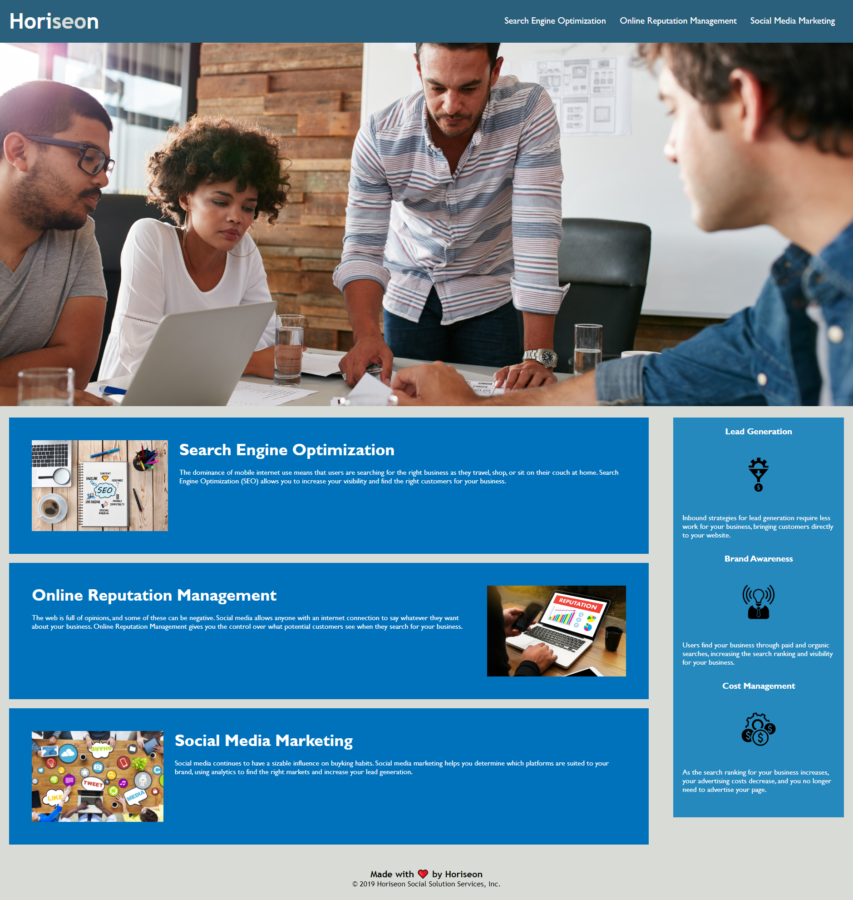

# Refactor of Horiseon Webpage

## Goal/Description of Project: 

    * To refactor the Horiseon webpage source code to be more accessible, minimize stylesheet literature, organize html elements, and ensure headings follow a logical structure order.

## Description of changes

### HTML Changes: 
    
    * Added alt attributes to all images for accesibility.
    * Added missing ID to HTML elements to fix broken links.
    * Added anchor to "Horiseon" in header to link to index.html (Homepage) Reasoning: 
        This is a preparatory setup step to allow any future pages to link back to the homepage.
    * Changed title of Webpage to "Horiseon".
    * Cleaned up HTML syntax by fixing indentation and adding line space between sections.
    * Replaced 
 elements with the appropriate semantic HTML elements such as <header>, <footer>, <section>, and <article>.
    
###  Consolidated CSS classes and selectors:
    * A review of the style sheet found that there were a number of classes that essentially dictated the same exact style. Such classes were replaced by a singular class along with the corresponding html element's class. 

    Example: 
    .benefit-lead {
        margin-bottom: 32px;
        color: #ffffff;
    }

    .benefit-brand {
        margin-bottom: 32px;
        color: #ffffff;
    }

    .benefit-cost {
        margin-bottom: 32px;
        color: #ffffff;
    }

    .benefit-lead h3 {
        margin-bottom: 10px;
        text-align: center;
    }

    .benefit-brand h3 {
        margin-bottom: 10px;
        text-align: center;
    }

    .benefit-cost h3 {
        margin-bottom: 10px;
        text-align: center;
    }

    .benefit-lead img {
        display: block;
        margin: 10px auto;
        max-width: 150px;
    }

    .benefit-brand img {
        display: block;
        margin: 10px auto;
        max-width: 150px;
    }

    .benefit-cost img {
        display: block;
        margin: 10px auto;
        max-width: 150px;
    }

    Were all replaced with: 

    .benefit-swag {
    margin-bottom: 32px;
    color: #ffffff;
    }

    .benefit-swag h3 {
        margin-bottom: 10px;
        text-align: center;
    }

    .benefit-swag img {
        display: block;
        margin: 10px auto;
        max-width: 150px;
    }

    This resulted in the CSS line count going from 200 lines to 145 lines.

## Screenshot of Live Webpage:

## Link to live website: https://rotichd.github.io/horiseon-module-1-challenge/